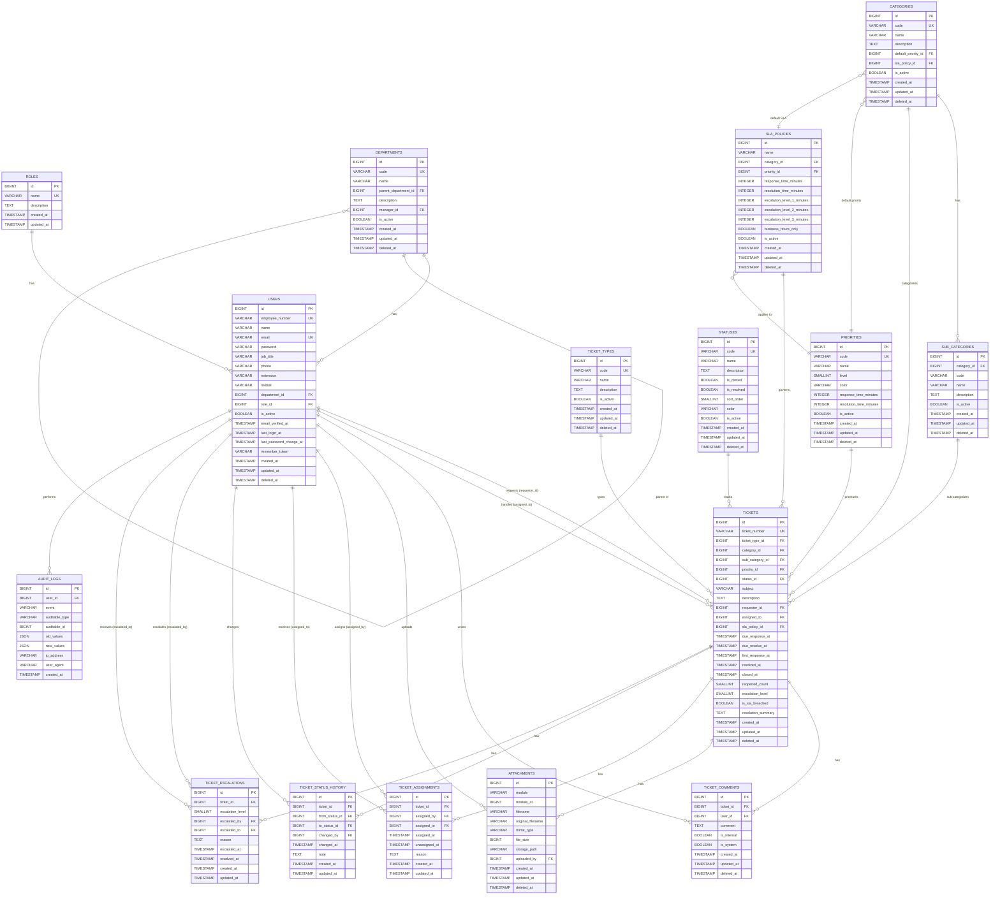

# MITO IT Helpdesk — Entity Relationship Diagram (ERD) — MVP

## 1. Normalization Level

The database design follows **Third Normal Form (3NF)**:

- **1NF:** All attributes are atomic; no repeating groups.
- **2NF:** All non-key attributes are fully dependent on the primary key.
- **3NF:** No transitive dependencies; non-key attributes depend only on the primary key.

### Normalization Decisions

| Decision | Rationale |
|----------|-----------|
| `roles` is a master table | Roles may change; avoids ENUM limitations |
| `categories` and `sub_categories` are separate tables | Avoids repeating category names in tickets; supports hierarchical categorization |
| `ticket_types` is a master table | Ticket types may evolve; supports future types |
| `priorities` and `statuses` are separate tables | Enables dynamic configuration without code changes; supports UI color coding |
| `ticket_assignments` and `ticket_status_history` are separate tables | Preserves full audit trail of ticket lifecycle |
| `sla_policies` is a separate table | SLA targets can be configured per category/priority without modifying tickets |
| `attachments` uses polymorphic `module`/`module_id` | Reusable attachment design for future modules |
| `audit_logs` uses polymorphic `auditable_type`/`auditable_id` | Single audit table for all entities |

---

## 2. ERD Diagram (Mermaid)



---

## 3. ERD Legend

| Symbol | Meaning |
|--------|---------|
| `||--o{` | One-to-Many (one entity has many) |
| `}o--||` | Many-to-One |
| `PK` | Primary Key |
| `FK` | Foreign Key |
| `UK` | Unique Key |

---

## 4. Entity Grouping

### 4.1 Master Data Group (MVP)
```
roles ────────┐
departments ──┼── users
              │
categories ───┼── sub_categories
ticket_types ─┼── tickets
priorities ───┼── sla_policies
statuses ─────┘
```

### 4.2 Transaction Data Group (MVP)
```
tickets ────────┬── ticket_comments
                ├── attachments
                ├── ticket_assignments
                ├── ticket_status_history
                └── ticket_escalations

audit_logs (standalone)
```

### 4.3 Future Modules (Deferred)
```
asset_types ──┐
locations ────┼── assets
              │
holidays ─────┘
knowledge_base
ticket_ratings
```

---

## 5. Cardinality Summary

| Relationship | Cardinality | Description |
|-------------|-------------|-------------|
| `roles` → `users` | 1:N | One role has many users |
| `departments` → `users` | 1:N | One department has many users |
| `departments` → `departments` | 1:N | One department has many child departments |
| `categories` → `sub_categories` | 1:N | One category has many sub-categories |
| `categories` → `tickets` | 1:N | One category has many tickets |
| `sub_categories` → `tickets` | 1:N | One sub-category has many tickets |
| `ticket_types` → `tickets` | 1:N | One ticket type has many tickets |
| `priorities` → `tickets` | 1:N | One priority has many tickets |
| `statuses` → `tickets` | 1:N | One status has many tickets |
| `sla_policies` → `tickets` | 1:N | One SLA policy governs many tickets |
| `users` → `tickets` (requester) | 1:N | One user requests many tickets |
| `users` → `tickets` (assigned_to) | 1:N | One user handles many tickets |
| `tickets` → `ticket_comments` | 1:N | One ticket has many comments |
| `tickets` → `attachments` | 1:N | One ticket has many attachments |
| `tickets` → `ticket_assignments` | 1:N | One ticket has many assignments |
| `tickets` → `ticket_status_history` | 1:N | One ticket has many status changes |
| `tickets` → `ticket_escalations` | 1:N | One ticket has many escalations |
| `users` → `attachments` | 1:N | One user uploads many attachments |
| `users` → `audit_logs` | 1:N | One user performs many audit events |